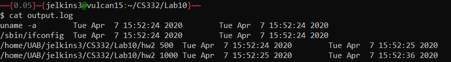
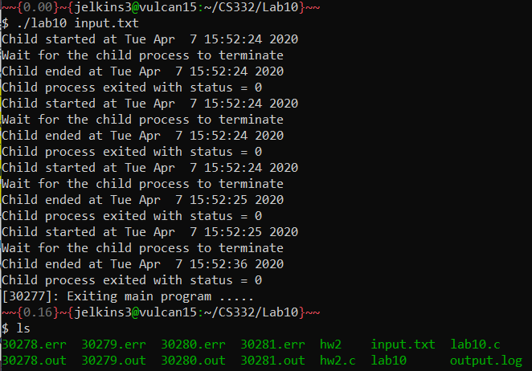
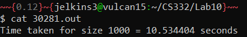
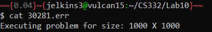

# CS332-Lab10

## Objective
The objective of this lab is to introduce us to create processes and manage them.
- Creating child processes using fork.
- Replacing child processes using exec
- Review Linux I/O Streams
- Discuss sharing between parent and child processes
- Review copying file descriptors – dup2() system call

## Description
Write a program that takes a filename as a command-line argument and performs the following steps:
- Open the file specified as the command-line argument.
- Read contents of the file one-line at a time.
- Use fork-exec to create a new process that executes the program specified in the input file along with the arguments provided.
- The child process will redirect the standard output stream (stdout) to a file <pid>.out and the standard error stream (stderr) to the file <pid>.err. Note that <pid> here corresponds to the process id of the child process. As a result of this change you will not see any output from the child process on the terminal, you have to look at the corresponding <pid>.out or <pid>.err file for the corresponding output and error messages.
- The parent process will make note of the time the program was started (you can use a timer such as the time function defined in <time.h> to capture the time before the fork method is invoked, you can find out more about time function by typing man time).
- Then the parent process will wait for the child process to complete and when the child process terminates successfully, the parent process will capture the time the child process completed (you can again use a timer function to capture the time when the wait function returns).
- Open a log file (say, output.log) and write the command executed along with arguments, start time of the process, and the end time of the process separated by tabs. Use ctime function to write the time in a human readable form.
- Go to step 2 and repeat the above process for very command in the input file.

## Setup
To compile and run this program:

```bash
$ gcc lab10.c -o lab10
$ ./lab10 <commands file> 
```

## Test cases
This project was tested using the [hw2.c](hw2.c) and [input.txt](input.txt) files. The [hw2.c](hw2.c) files writes to both the standard out stream and standard error stream, so it is an ideal program to test if the program is printing to the correct files. Once downloaded, you can compile the [hw2.c](hw2.c) program using the following command:

```bash
$ gcc -Wall -O -o hw2 hw2.c
```

Example input file:
```
uname -a
/sbin/ifconfig
/home/UAB/jelkins2/CS332/lab10/hw2 500
/home/UAB/jelkins3/CS332/Lab10/hw2 1000
```

Example output of the log file:
```
uname -a    Thu Oct 10 17:43:44 2019    Thu Oct 10 17:43:44 2019
/sbin/ifconfig    Thu Oct 10 17:43:44 2019    Thu Oct 10 17:43:44 2019
/home/UAB/jelkins3/CS332/Lab10/hw2 500    Thu Oct 10 17:43:45 2019    Thu Oct 10 17:43:46 2019
/home/UAB/jelkins3/CS332/Lab10/hw2 1000    Thu Oct 10 17:43:46 2019    Thu Oct 10 17:43:57 2019
```



## Screenshots








## Contact Information
email: [jelkins3@uab.edu](mailto:jelkins3@uab.edu)

## Sources

- This lab was inspired by lab7_solution.c provided by Dr. Puri. 