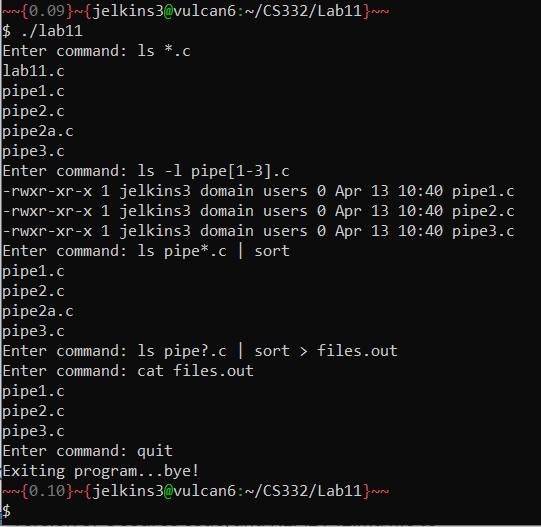

# CS332-Lab11

## Objective
Use pipes to communicate between processes

## Description
Write a program what will prompt the user to enter a UNIX command that consists of all acceptable wildcards and special characters (characters a typical shell would accept) and execute the command using popen and pclose. The program should execute the command entered, display the output from the program to the terminal, and prompt the user to enter another command. When the user enters the command as "quit" the program should exit.

## Setup
To compile and run this program:

```bash
$ gcc lab11.c -o lab11
$ ./lab11
```

## Test cases

Example run:
```
$ ./lab11
Enter command: ls *.c
pager2.c pager.c pipe1.c pipe2a.c pipe2.c pipe3.c
Enter command: ls -l pipe[1-3].c
-rwxr-xr-x 1 jelkins3 domain users 2073 Oct 31 10:40 pipe1.c
-rwxr-xr-x 1 jelkins3 domain users 2784 Oct 31 10:40 pipe2.c
-rwxr-xr-x 1 jelkins3 domain users 3859 Oct 31 10:43 pipe3.c
Enter command: ls pipe*.c | sort
pipe1.c
pipe2a.c
pipe2.c
pipe3.c
Enter command: ls pipe?.c | sort > files.out
Enter command: cat files.out
pipe1.c
pipe2.c
pipe3.c
Enter command: quit
Exiting program...bye!
$ 
```


## Screenshots




## Contact Information
email: [jelkins3@uab.edu](mailto:jelkins3@uab.edu)

## Sources

- This lab was inspired by popen.c provided by Dr. Puri. 