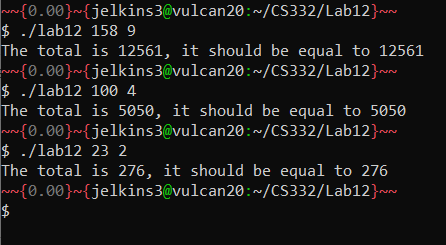

# CS332-Lab12

## Objectives
- Create threads using POSIX threads library
- Thread synchronization using Mutexes 

## Description
Modify the [pthread_sum.c](pthread_sum.c) program to create a structure and pass the structure as argument to the thread creation function instead of using global variables a, sum, N, and size. You have to create a structure that contains the variables a and sum with type double, variables N and size with type int, and variable tid with type long or int. You have to create an instance of this structure specific to each thread and pass the structure as an argument to the corresponding thread creation function. Test the program for different values of N and number of threads and make sure that the result is correct.

## Setup
To compile and run this program:

```bash
$ gcc lab12.c -o lab12 -lpthread
$ ./lab12 <no. of elements> <no. of threads>
```

## Test cases

Example run:
```bash
$ ./lab12 100 4
The total is 5050, it should be equal to 5050
$ 
```


## Screenshots




## Contact Information
email: [jelkins3@uab.edu](mailto:jelkins3@uab.edu)

## Sources

- This lab was inspired by [pthread_sum.c](pthread_sum.c) provided by Dr. Puri. 