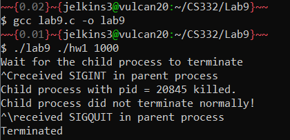

# CS332-Lab9

## Objective
The objective of this lab is to introduce you to signal handling in UNIX.

## Description
Modify the program [forkexecvp.c](forkexecvp.c) such that when you type Control-C or Control-Z the child process is interrupted or suspended and the parent process continues to wait until it received a quit signal (Control-\).

## Setup
To compile and run this program:
```
$ gcc lab9.c -o lab9
$ ./lab9 <command> [arguments for given command]
```

## Sample Output



## Sources

- This lab was inspired by [forkexecvp.c](forkexecvp.c) example provided by Dr. Puri. 