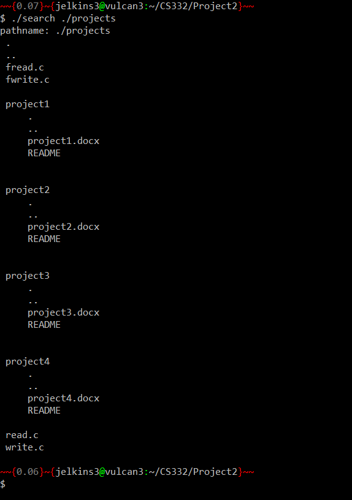
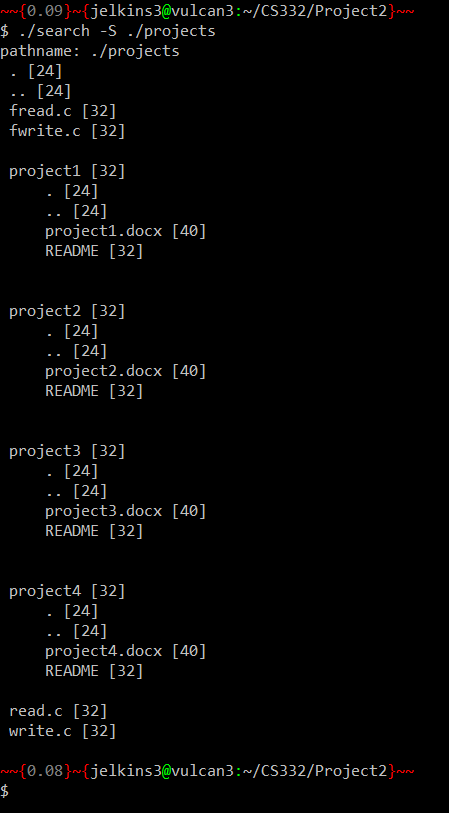
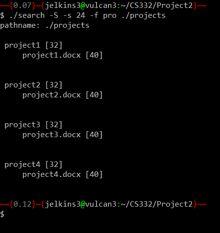

# CS332-Project2

## Objective
The objective of this project is to practice implementing UNIX file system and properties of files.

## Description
Find is a popular UNIX command that traverses a file hierarchy and performs various functions on each file in the hierarchy. The goal of this project is to implement a program similar called search that supports the following functionality:

The program should take the directory name from where to start the file traversal as a command-line argument and print the file hierarchy starting with the directory that is provided by the command-line argument.

- If the program is executed without any arguments, the program should print the file hierarchy starting with the current directory where the program is executed. If there are no directories in the current directory only files are listed one per line.
- If there are other directories in the current directory then the directory name is first displayed on a separate line and then the files in that directory are listed one-per-line with one-tab indentation.
- If a file is a symbolic link then the program should display the symbolic link name and in parentheses the file name the link points to.
- The program should also support three command-line options:
-S
- This should list all files in the file hierarchy and print the file size next to the filename in parenthesis. 
-s <file size in bytes>
- This should list all files in the file hierarchy with file size greater than or equal to the value specified.
-f <string pattern>
- This should list all files in the file hierarchy whose file name or directory name contains the substring specified in the string pattern option.
- The program should support not only each of these options separately but also any combination of these options. For example: -S, -s 1024, -f jpg, -S -s 1024, -S -f jpg, -s 1024 -f jpg, -S -s 1024 -f jpg, -S -f jpg -s 1024.
- If both -s and -f options are specified then the program should list only those files that match both criteria. The order of the options should not matter.

## Setup
To compile and run this program:
```
$ gcc search.c -o search
$ ./search <command-line arguments> <directory name>
```

Example:
```
$ gcc search.c -o search
$ ./search .
pathname: .
 .
 ..
 a.out

 Directory1
   .
   ..
   fileInsideDirectory1

search.c
search

```

## Sample Output








## Sources

- This lab was inspired by readdir_v2.c example provided by Dr. Puri. Used while-loop implementation and error message if statement. Added comments, put inside fileTraversal function, added snprintf, and changed variable names.
- snprintf usage inspired by [GeeksForGeeks](https://www.geeksforgeeks.org/snprintf-c-library/)
- strstr usage inspried by [GeeksForGeeks](https://www.geeksforgeeks.org/strstr-in-ccpp/) and the man page for strstr.