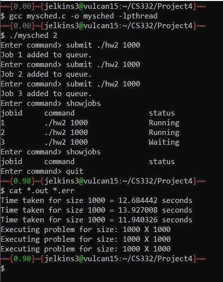

# CS332-Project4

## Objective
To implement a simple job scheduler that executes non-interactive jobs (e.g., jobs that do not have direct user interaction,  jobs that can run in the background). 

## Description
In this project we will implement a simple job scheduler that will execute non-interactive jobs (for example, jobs that do not have direct user interaction,  jobs that can run in the background). At any given time only P jobs should be executing and P is provided as an argument to your program. If you have more than P jobs submitted, then these additional jobs must wait until one of the P executing jobs are completed. You can assume that P is typically the number of cores that are available on a system and you are executing one process per core and if there are more jobs than the available number of cores these jobs must wait for one of the processes to complete.  When you launch the program with P as the command-line argument, the program should print a prompt and wait for the user to enter commands. As the jobs are non-interactive, the output and error streams from the job must be written to separate files - <jobid>.out and <jobid>.err, where <jobid> is the appropriate job id that is associated with a job. 

The following commands must be supported by your program: 
 - submit <program arguments> : Create a new process to execute the program specified with any arguments and print a jobid to standard output  
 - showjobs : List all process that are either currently waiting or running (only those process that were started using the submit command). The output should include the jobid assigned to each job and the status of the jobs (whether it is running or waiting). If the job has completed, it will not be listed. 

## Setup
To compile and run this program:

```bash
$ gcc mysched.c -o mysched -lpthread
$ ./mysched <no. of cores>
```

## Test cases

Example run:
```bash
$ ./mysched 2
Enter command> submit /home/UAB/jelkins3/CS332/shared/hw1 1000
job 1 added to the queue
Enter command> submit /home/UAB/jelkins3/CS332/shared/hw2 1000
job 2 added to the queue
Enter command> submit /home/UAB/jelkins3/CS332/shared/hw3 1000
job 3 added to the queue
Enter command> showjobs
jobid  command                                 status
1      /home/UAB/jelkins3/CS332/shared/hw1 1000    Running
2      /home/UAB/jelkins3/CS332/shared/hw2 1000    Running
3      /home/UAB/jelkins3/CS332/shared/hw3 1000    Waiting
Enter command> 
#after some time
Enter command> showjobs
jobid  command                                 status
1      /home/UAB/jelkins3/CS332/shared/hw3 1000    Running
Enter command> quit
$
```


## Screenshots




## Contact Information
email: [jelkins3@uab.edu](mailto:jelkins3@uab.edu)

## Sources

- This project's queue was inspired by [queue.tar](queue.tar) provided by Dr. Puri.
- The fork/exec structure was inspired by [project4_sample.c](project4_sample.c) provided by Dr. Puri.